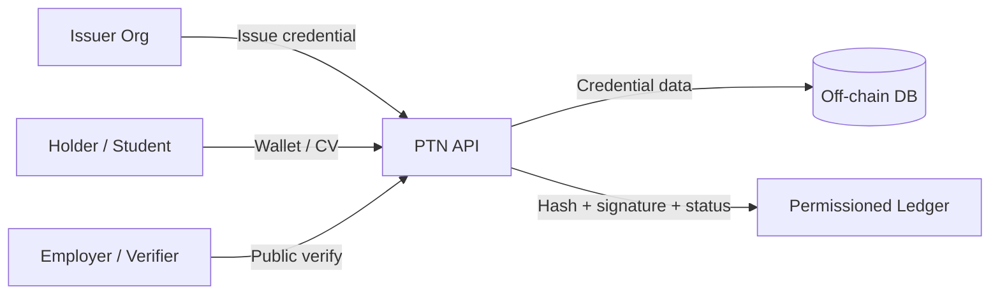

> **What if your degree, employment history and professional certifications could be verified in seconds instead of relying on PDFs, phone calls and manual verification?**

# Pakistan Trust Network (PTN)

**Issue. Own. Verify.**

Pakistan Trust Network is an open-source trust layer for educational and professional credentials. Think of it like a sealed envelope that anyone can check without opening the private papers inside: institutions **issue** credentials, people **own** them in a digital wallet, and anyone can **verify** them in seconds.

How it works in plain language:

1. A university, employer, or training institute creates a credential (for example: “BS Computer Science”).
2. The full details stay in a normal database (**data off-chain**).
3. Only a cryptographic fingerprint (hash), signature, and status proof go onto a permissioned ledger (**proof on-chain**).
4. When someone opens a verify link, PTN checks the signature, the hash, the ledger entry, and whether the credential was revoked.

No phone calls. No “please email us a PDF.” No relying on screenshots that can be edited.

---

## What PTN is

- A **reference implementation** of verifiable credential infrastructure for Pakistan and beyond
- A system where **proof lives on a permissioned ledger** and **personal data stays off-chain**
- A wallet + public verification + explorer stack you can run locally with Docker
- An open protocol goal: institutions can issue; holders can own; verifiers can check

## What PTN is not

- **Not a cryptocurrency.** There is no PTN token, no mining rewards, no wallet balances in coins.
- **Not a public blockchain speculation product.** The ledger is a **permissioned, append-only** integrity log.
- **Not affiliated with or endorsed by any government** of Pakistan or any other state.
- **Not a replacement for legal identity systems** (CNIC, NADRA, passports). PTN deliberately avoids storing national ID numbers and similar sensitive fields.
- **Not production-ready without your own hardening**, key management, and operational controls.

Demo organizations in the seed data are clearly labelled **DEMO — NOT AN ACTUAL VERIFIED INSTITUTION**.

---

## Architecture at a glance



**Proof on-chain / data off-chain:** the ledger stores hashes, transaction types, issuer DIDs, and signatures — not CNICs, addresses, salaries, or full transcript dumps.

More detail: [docs/architecture.md](docs/architecture.md) · [docs/blockchain.md](docs/blockchain.md) · [docs/privacy.md](docs/privacy.md)

---

## Quick start (Docker Compose)

**Requirements:** Docker Desktop (Windows/macOS) or Docker Engine + Compose.

Anyone can run the same stack — no local Python/Node install required:

```bash
git clone https://github.com/YOUR_ORG/ptn.git
cd ptn
docker compose up --build
```

Then open **http://localhost:3000**

| Service   | URL                                      |
|-----------|------------------------------------------|
| Website   | http://localhost:3000                    |
| API docs  | http://localhost:3000/api/docs           |
| Direct API| http://localhost:8000                    |
| Health    | http://localhost:8000/health             |

The browser calls `/api` on the **same host** as the website, so other devices on your Wi‑Fi can use `http://YOUR_LAN_IP:3000`.

Detached (keeps running until you stop it):

```bash
docker compose up --build -d
```

### Public / 24/7 demo on a VPS

```bash
docker compose --profile public up --build -d
```

That publishes **port 80** via Caddy. Full steps: [docs/self-host.md](docs/self-host.md).

Optional extra validator processes:

```bash
docker compose --profile multi-node up --build
```

---

## Demo accounts

All demo users share password **`DemoPass123!`** unless noted.

| Role       | Email                   | Password         |
|------------|-------------------------|------------------|
| Student    | `student@demo.ptn`      | `DemoPass123!`   |
| University | `university@demo.ptn`   | `DemoPass123!`   |
| Employer   | `employer@demo.ptn`     | `DemoPass123!`   |
| Training   | `training@demo.ptn`     | `DemoPass123!`   |
| Admin      | `admin@ptn.demo`       | `AdminPass123!`  |

Suggested tour:

1. Log in as **student** → open Wallet and public CV.
2. Log in as **university** → issue or list credentials.
3. Open a verification URL (`/verify/{credentialId}`) without logging in.
4. Visit the Explorer and run chain verification.

---

## Documentation

| Document | Description |
|----------|-------------|
| [Self-host / Docker](docs/self-host.md) | Run locally, share on LAN, or host a public demo |
| [Architecture](docs/architecture.md) | System design, flows, Mermaid diagrams |
| [Blockchain / ledger](docs/blockchain.md) | Permissioned ledger, blocks, `verify_chain` |
| [Credentials](docs/credentials.md) | VC-inspired model, types, signing |
| [Identity](docs/identity.md) | `ptn:org` / `ptn:user` DIDs, Ed25519 |
| [Privacy](docs/privacy.md) | On-chain vs off-chain, prohibited fields |
| [Security](docs/security.md) | JWT, argon2, RBAC, headers, rate limits |
| [API](docs/api.md) | Endpoint reference under `/api` |
| [Deployment](docs/deployment.md) | Docker, cloud options, environment variables |
| [Governance](docs/governance.md) | Proposed future council, open protocol |
| [Contributing](docs/contributing.md) | Conventional commits, PR checks, conduct |

---

## Stack

- **Backend:** FastAPI, SQLAlchemy, PostgreSQL, Ed25519 (PyNaCl), argon2, JWT
- **Frontend:** Next.js
- **Ledger:** Permissioned, cryptographically linked blocks with Merkle roots
- **SDKs:** TypeScript and Python clients under `sdk/`

---

## Disclaimer

Pakistan Trust Network is an **open-source reference implementation** maintained by its contributors. It is **not** a government product, **not** an official national credential system, and **not** endorsed by any ministry, regulator, or public authority. Demo issuers are simulated for education and development only.

Use this software at your own risk. See [LICENSE](LICENSE) (MIT).
