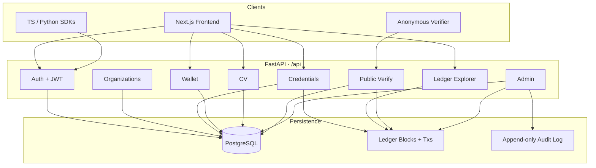
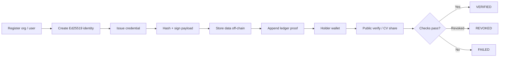
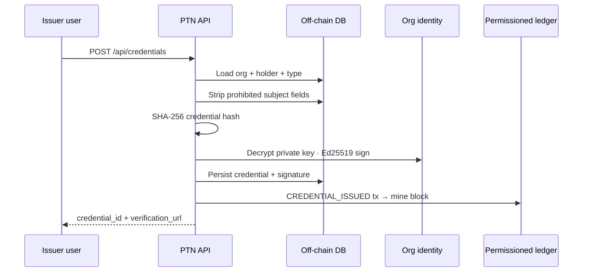
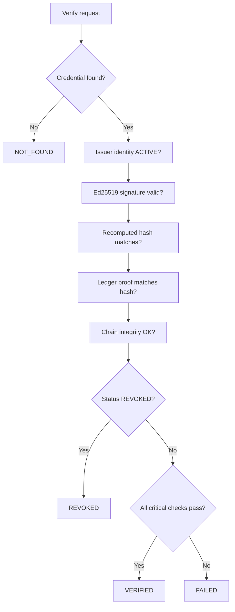
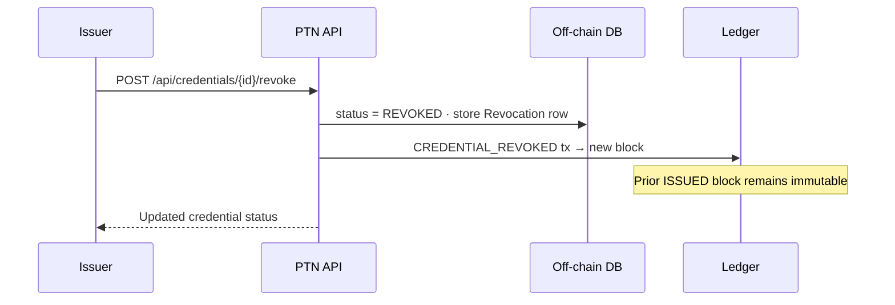
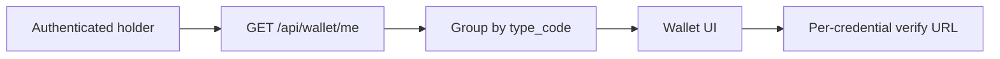
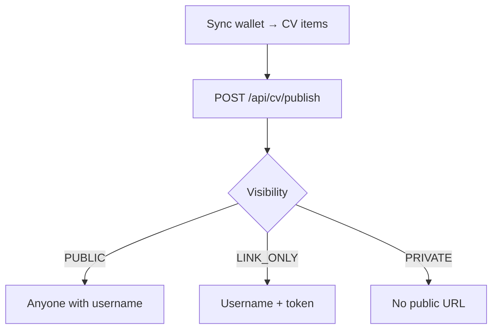
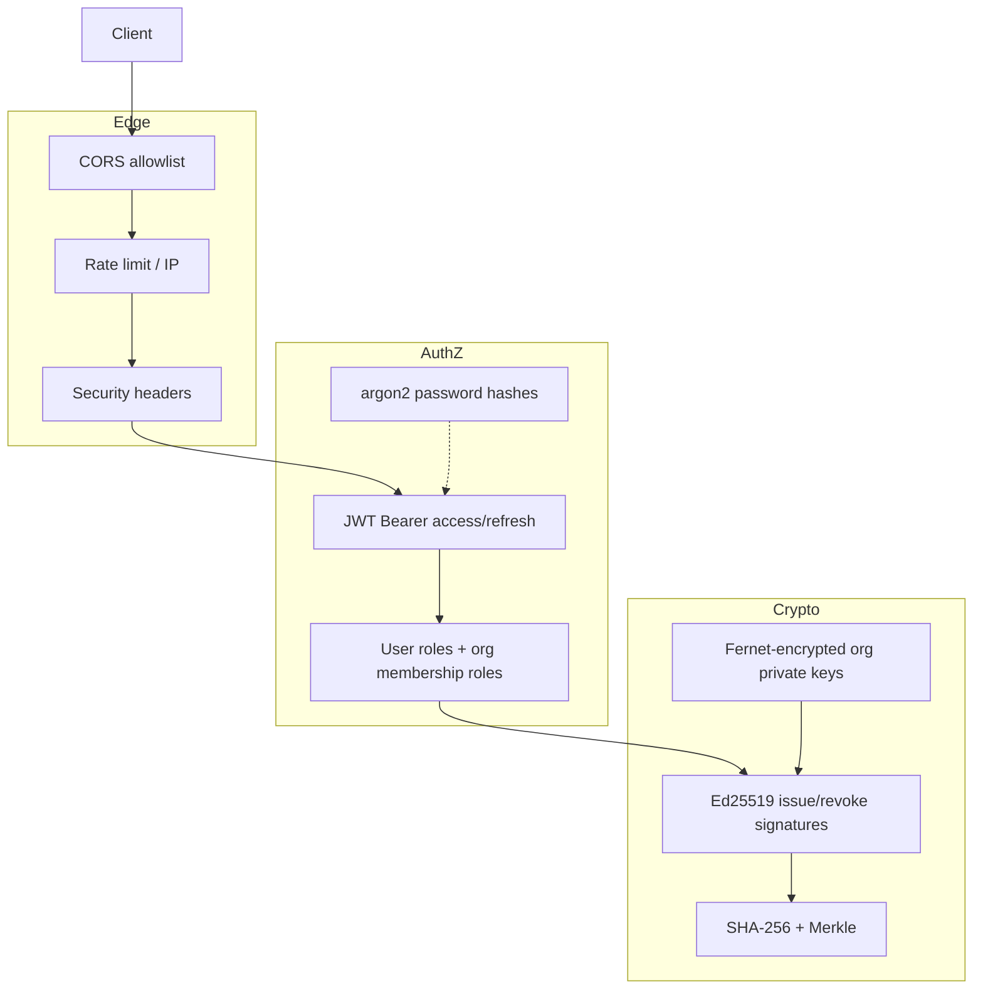
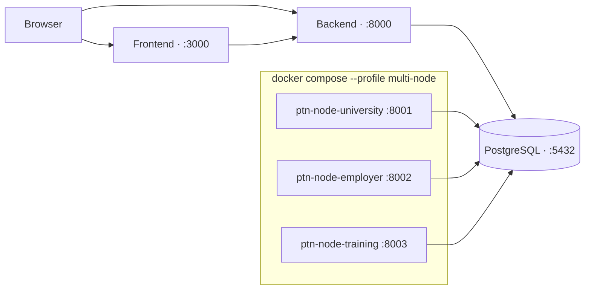

# Architecture

Pakistan Trust Network (PTN) is designed around one principle:

> **Proof on-chain. Data off-chain.**

Credentials are issued, owned, and verified without putting personal payloads on the ledger. The ledger records integrity proofs; the application database stores credential content under access control.

**Tagline:** Issue. Own. Verify.

**Disclaimer:** PTN is an open-source reference implementation. It is not affiliated with or endorsed by any government.

---

## System overview

| Layer | Responsibility |
|-------|----------------|
| Frontend | Dashboards, wallet, issue UI, explorer, public verify/CV pages |
| API | Auth, RBAC, issuance, revocation, verification, stats |
| Off-chain DB | Users, orgs, credential subjects, encrypted org keys, CV profiles |
| Permissioned ledger | Append-only blocks of hashes, signatures, status events |
| Audit log | Hash-chained operational events for operators |

---

## Spec-aligned high-level flow

---

## Issuance

Only members with issuer-capable roles (`OWNER`, `ISSUER`, `ADMIN`) — or platform admins — may issue for an organization.

On-chain (in the transaction / block):

- `credential_id`, `credential_hash`, `issuer_id` (DID)
- `digital_signature`, `metadata_hash`, `transaction_type`

Off-chain:

- Full `credential_subject` (after sensitive-field stripping)
- Titles, membership, encrypted private keys

---

## Verification

`GET /api/verify/{credential_id}` is public (no auth).

Critical checks for `VERIFIED`:

1. Issuer identity present and active  
2. Signature verified against org public key  
3. Credential integrity (hash)  
4. Ledger proof present and consistent  
5. Not revoked  

Chain integrity is also reported (`chain_integrity_verified`) for explorer / ops visibility.

---

## Revocation

Issuers append a new ledger event; history is never rewritten.

Public verification thereafter returns overall `REVOKED` and optional public reason.

---

## Wallet

Holders see credentials grouped by category (education, professional, skills, achievement).

Admins (or the user themselves) may also call `GET /api/wallet/users/{user_id}`.

---

## Verifiable CV

CV profiles sync from wallet credentials and can be published:

| Visibility | Behavior |
|------------|----------|
| `PRIVATE` | Not publicly listed |
| `PUBLIC` | Available at `/cv/{username}` |
| `LINK_ONLY` | Requires share token query param |

---

## Security architecture

See [security.md](security.md) for details.

---

## Deployment topology

Today’s multi-node profile demonstrates **distinct validator identities** against a **shared ledger database**. Future work may add peer replication and consensus — see [blockchain.md](blockchain.md) and [deployment.md](deployment.md).

---

## Component map (repository)

| Path | Role |
|------|------|
| `backend/app` | FastAPI application, ledger, credentials, identity |
| `frontend/src` | Next.js UI |
| `sdk/typescript`, `sdk/python` | Thin API clients |
| `docker-compose.yml` | Local full stack |
| `docs/` | This documentation set |

---

## Design invariants

1. **No token economy** — ledger is integrity infrastructure, not a currency.  
2. **Append-only proofs** — revocation adds events; it does not delete history.  
3. **Minimal public surface** — verify endpoints expose display-safe fields only.  
4. **Demo honesty** — seeded orgs carry `is_demo` / `demo_label` flags.  
5. **No government claim** — PTN does not speak for any public authority.
