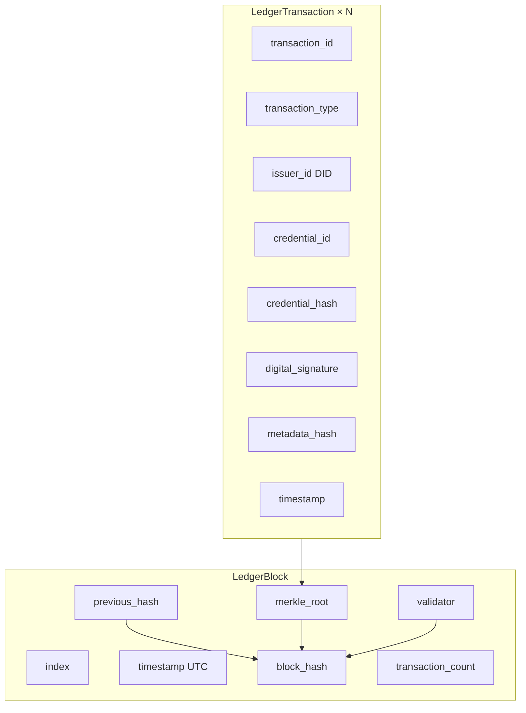
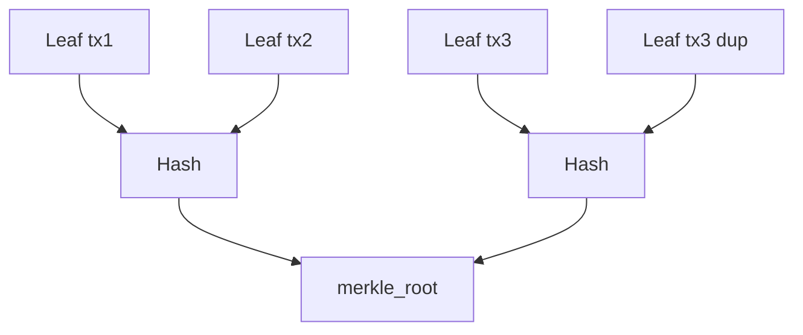
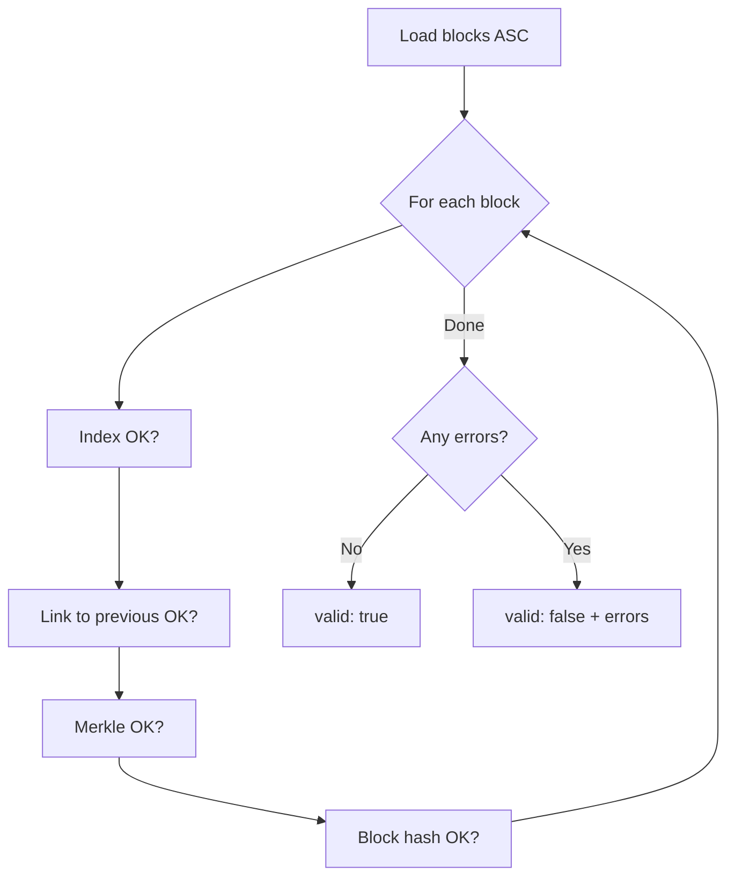
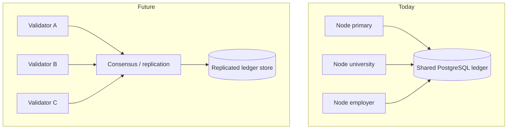

# Blockchain / Permissioned Ledger

PTN uses a **permissioned, cryptographically linked, append-only ledger** — not a public cryptocurrency chain.

**Proof on-chain. Data off-chain.** Credential subjects, personal identifiers, and documents remain in the application database. The ledger stores integrity proofs and status events.

There is **no PTN coin**, no mining market, and no speculative wallet balance.

---

## Why a permissioned ledger?

| Goal | Approach |
|------|----------|
| Tamper evidence | Each block hashes the previous block |
| Efficient inclusion proofs | Merkle root over transaction leaves |
| Institutional accountability | Validator identity recorded per block |
| Privacy | Hashes and DIDs — not CNIC or full payloads |
| Operability | PostgreSQL-backed reference implementation |

This is trust infrastructure for **Issue. Own. Verify.** — not a trading venue.

---

## Block structure



### Genesis

- Index `0`
- `previous_hash` = sixty-four `0` characters
- Empty transaction set; Merkle root of empty set = `sha256("empty")`
- Created automatically on API startup via `LedgerService.ensure_genesis()`

### Block hash input

The block hash is SHA-256 over canonical JSON of:

```json
{
  "index": 1,
  "timestamp": "<ISO-8601>",
  "previous_hash": "<hex>",
  "merkle_root": "<hex>",
  "validator": "ptn:validator:…",
  "transactions": ["PTN-TX-…", "…"]
}
```

### Transaction types (current)

| Type | Meaning |
|------|---------|
| `CREDENTIAL_ISSUED` | Issuance proof anchored |
| `CREDENTIAL_REVOKED` | Revocation event anchored |

Transaction IDs look like `PTN-TX-{16 hex chars}`.

---

## Merkle trees

Leaf hashes are SHA-256 digests of each transaction’s canonical fields (id, type, issuer, credential id/hash, timestamp, signature, metadata hash). Sibling pairs are hashed upward; an odd last leaf is duplicated (standard binary padding).



---

## Mining model (MVP)

In the reference implementation, each append typically **auto-mines** a block containing the pending transaction(s). Validators are configured via environment:

| Variable | Purpose |
|----------|---------|
| `LEDGER_VALIDATOR_ID` | Identity string recorded on blocks (e.g. `ptn:validator:genesis`) |
| `LEDGER_NODE_NAME` | Human-readable node name for ops |

Compose’s `multi-node` profile runs additional API processes with distinct validator IDs against the **same** database — a design demo, not full BFT consensus yet.

---

## `verify_chain`

`GET /api/ledger/verify-chain` walks every block in order and checks:

1. Contiguous indices (`0 … height`)
2. Genesis `previous_hash` sentinel
3. Each block’s `previous_hash` equals the prior `block_hash`
4. Recomputed Merkle root matches (non-empty blocks)
5. Recomputed `block_hash` matches stored value



Example success payload shape:

```json
{
  "valid": true,
  "height": 12,
  "block_count": 13,
  "errors": [],
  "message": "Chain integrity verified"
}
```

A development-only admin endpoint can deliberately corrupt a block hash to demonstrate detection (`POST /api/ledger/dev/tamper-block/{height}`). It is **disabled in production** and labelled as a simulation — it is not a forging toolkit.

---

## Explorer APIs

| Method | Path | Description |
|--------|------|-------------|
| `GET` | `/api/ledger/blocks` | Recent blocks + height |
| `GET` | `/api/ledger/blocks/{height}` | Block + transactions |
| `GET` | `/api/ledger/transactions/{tx_id}` | Single transaction summary |
| `GET` | `/api/ledger/search?q=` | Search by height, hash, tx, credential id |
| `GET` | `/api/ledger/verify-chain` | Full integrity report |

Public responses intentionally omit bulky signature blobs where not needed; they expose `has_signature` instead.

---

## Multi-node future



### Near-term roadmap (proposed)

1. **Peer gossip** of candidate blocks between independently operated nodes  
2. **Quorum signatures** from a validator set defined by governance  
3. **Snapshot + checkpoint** export for auditors  
4. **HSM-backed** validator keys (see [identity.md](identity.md))  
5. Optional **external anchoring** of periodic Merkle roots to a public timestamping service — still without moving personal data on-chain  

Until then, treat the ledger as a strong **integrity log** operated by whoever runs the deployment, with cryptographic detection of silent rewrite attempts via `verify_chain`.

---

## What never goes on-chain

- CNIC / national ID numbers  
- Passport numbers, addresses, phone numbers, emails in credential subjects  
- Dates of birth, salaries, biometrics  
- Full private keys  
- Raw PDF documents  

See [privacy.md](privacy.md).

---

## Related docs

- [Architecture](architecture.md)  
- [Credentials](credentials.md)  
- [Security](security.md)  
- [Governance](governance.md)
