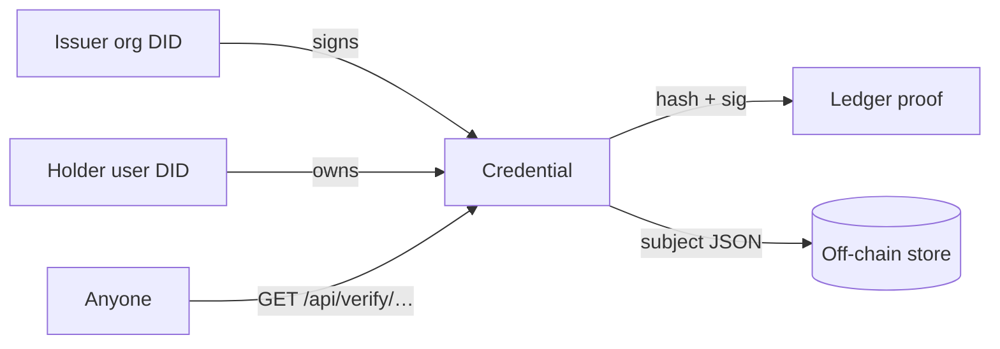
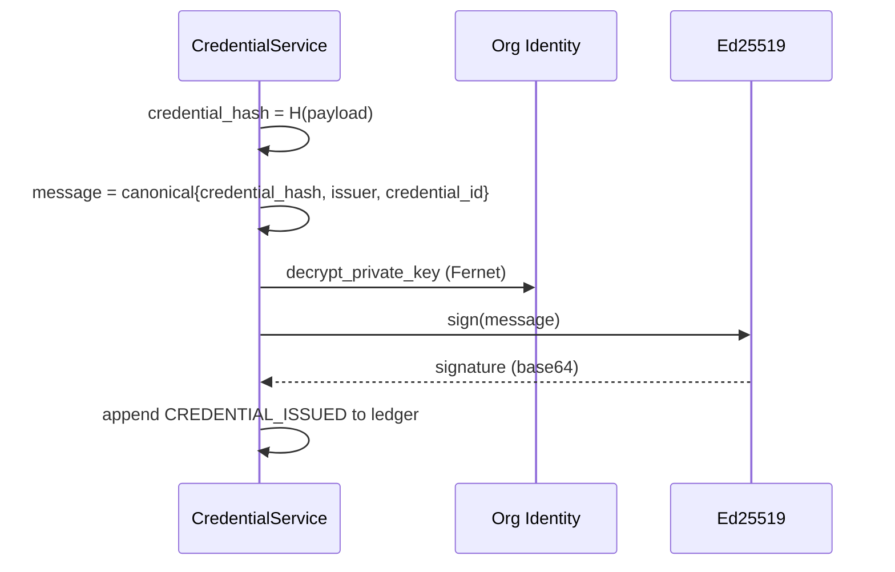
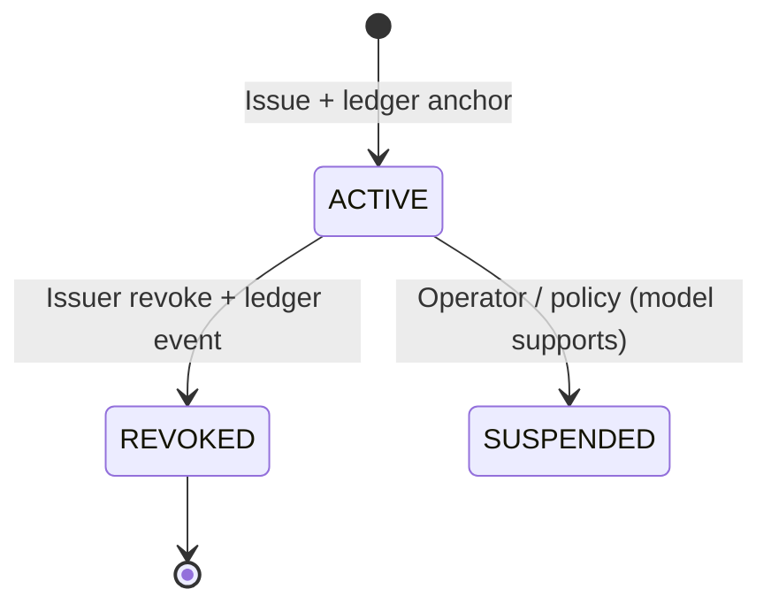

# Credentials

PTN credentials are **verifiable credential (VC)–inspired**: they have an issuer, a holder, a typed payload, a content hash, and an Ed25519 proof. They are not a strict W3C VC JSON-LD implementation in this MVP, but they follow the same mental model.

**Issue. Own. Verify.**  
**Proof on-chain / data off-chain.**

---

## Mental model



| Concept | PTN field |
|---------|-----------|
| Credential id | `ptn:cred:{hex}` |
| Type | `type_code` (registered `CredentialType`) |
| Issuer | Organization DID (`ptn:org:…`) |
| Holder | User DID (`ptn:user:…`) |
| Claims | `credential_subject` (off-chain) |
| Integrity | `credential_hash` = SHA-256(canonical JSON) |
| Proof | `Ed25519Signature` over hash + issuer + id |
| Status | `ACTIVE` · `REVOKED` · `SUSPENDED` |
| Anchoring | `ledger_tx_id` → permissioned ledger |

---

## Issuance payload (hashed)

Before hashing, PTN builds:

```json
{
  "credential_id": "ptn:cred:…",
  "type": "UniversityDegree",
  "issuer": "ptn:org:…",
  "holder": "ptn:user:…",
  "title": "BS Computer Science",
  "credential_subject": { "degree": "BS Computer Science", "graduation_year": 2026 }
}
```

Canonical JSON (sorted keys, compact separators) → SHA-256 hex → `credential_hash`.

A separate `metadata_hash` covers a small public metadata bundle (`title`, `type`, `issuer_name`) for ledger metadata without duplicating the full subject.

---

## Signing



Verification recomputes the message from the stored hash and checks the signature against the organization’s **public** key. Private keys never leave the encrypted column except briefly in memory during sign operations.

---

## Credential types

Seeded extensible types:

### Education

| Code | Display |
|------|---------|
| `UniversityDegree` | University Degree |
| `Degree` | Degree |
| `Diploma` | Diploma |
| `Certificate` | Certificate |
| `Transcript` | Transcript |
| `CourseCompletion` | Course Completion |
| `Scholarship` | Scholarship |
| `AcademicAward` | Academic Award |

### Professional

| Code | Display |
|------|---------|
| `Employment` | Employment |
| `Internship` | Internship |
| `ProfessionalCertification` | Professional Certification |
| `Training` | Training |
| `License` | License |

### Achievement / skills

| Code | Display |
|------|---------|
| `Award` | Award |
| `Competition` | Competition |
| `Publication` | Publication |
| `Project` | Project |
| `SkillEvidence` | Skill Evidence |

Wallet grouping maps these codes into `education`, `professional`, `skills`, and `achievement` categories.

---

## Public vs private fields

Each credential stores `public_fields` (default: `title`, `type`, `issuer_name`, `issued_at`, `status`). Public verification returns a **filtered** `public_subject`, plus issuer/holder display-safe metadata — not the entire off-chain record for arbitrary consumers beyond those rules.

Sensitive keys are stripped at issuance time (defense in depth), including but not limited to: `cnic`, `passport`, `address`, `phone`, `email`, `date_of_birth` / `dob`, `salary`, `biometric`. See [privacy.md](privacy.md).

---

## Lifecycle



Revocation creates a `Revocation` row and a `CREDENTIAL_REVOKED` ledger transaction. Prior issuance proofs remain for audit; verification reports `overall: "REVOKED"`.

---

## API surface (summary)

| Method | Path | Auth | Purpose |
|--------|------|------|---------|
| `POST` | `/api/credentials` | Issuer | Issue |
| `GET` | `/api/credentials/{id}` | Holder / issuer member / admin | Fetch |
| `POST` | `/api/credentials/{id}/revoke` | Issuer | Revoke |
| `GET` | `/api/credentials/issued/{org_id}` | Issuer | List issued |
| `GET` | `/api/verify/{id}` | Public | Cryptographic verify |
| `POST` | `/api/credentials/demo/tamper-check` | Auth | Integrity demo |

Full reference: [api.md](api.md).

---

## Demo credentials

The seed script issues demo credentials to `student@demo.ptn` from demo university, employer, and training orgs. All carry `is_demo=true`. They illustrate the protocol; they are **not** real institutional attestations.

---

## Related docs

- [Identity](identity.md)  
- [Blockchain](blockchain.md)  
- [Privacy](privacy.md)
