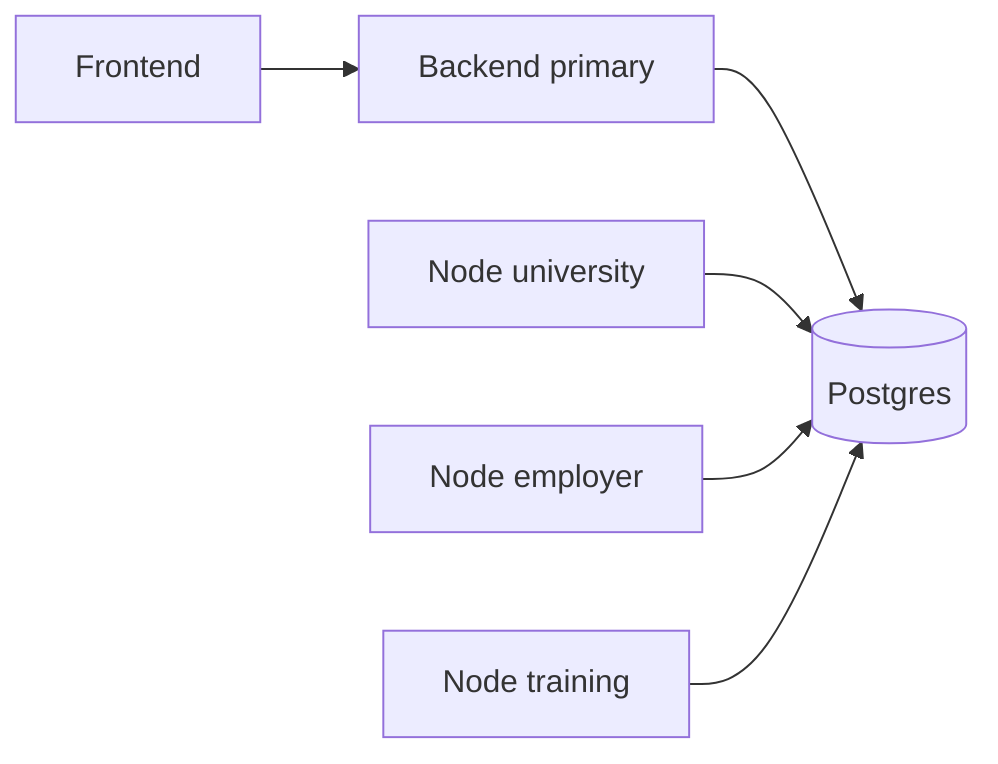
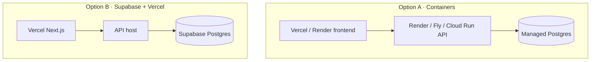

# Deployment

This guide covers running Pakistan Trust Network locally and deploying to common cloud targets. Configuration is **environment-driven** — do not hardcode secrets, URLs, or passwords in source.

**Disclaimer:** PTN is an open-source reference stack, not a government system.

---

## Principles

1. Copy `.env.example` → `.env` (or set platform env vars).  
2. Generate strong `JWT_SECRET` (≥ 32 characters) and `ENCRYPTION_KEY`.  
3. Point `DATABASE_URL` at your managed Postgres.  
4. Set `PTN_ENV=production`, `PTN_DEBUG=false`.  
5. Restrict `PTN_CORS_ORIGINS` to your real frontend origin(s).  
6. Keep **proof on-chain / data off-chain** topology: one API + DB (+ optional extra validator nodes).

---

## Docker Compose (recommended local)

```bash
cp .env.example .env
# edit secrets
docker compose up --build
```

| Service | Port | Notes |
|---------|------|-------|
| `db` | 5432 | Postgres 16 |
| `backend` | 8000 | Runs seed then uvicorn |
| `frontend` | 3000 | `NEXT_PUBLIC_API_URL` |

Multi-node demo:

```bash
docker compose --profile multi-node up --build
```

Additional nodes listen on `8001`–`8003` with distinct `LEDGER_VALIDATOR_ID` values sharing the same database.



---

## Environment variables

| Variable | Required | Purpose |
|----------|----------|---------|
| `PTN_ENV` | Yes | `development` / `production` |
| `PTN_DEBUG` | Yes | Verbose errors if true |
| `PTN_APP_NAME` | No | Display name |
| `PTN_API_URL` | Yes | Public API URL |
| `PTN_FRONTEND_URL` | Yes | Used in verification/CV links |
| `PTN_CORS_ORIGINS` | Yes | Comma-separated origins |
| `DATABASE_URL` | Yes | SQLAlchemy URL (`postgresql+psycopg://…`) |
| `JWT_SECRET` | Yes | ≥ 32 characters |
| `JWT_ALGORITHM` | No | Default `HS256` |
| `JWT_ACCESS_TOKEN_EXPIRE_MINUTES` | No | Default `30` |
| `JWT_REFRESH_TOKEN_EXPIRE_DAYS` | No | Default `14` |
| `ENCRYPTION_KEY` | Yes | Fernet key or passphrase (prod: real Fernet) |
| `LEDGER_VALIDATOR_ID` | No | Block validator identity |
| `LEDGER_NODE_NAME` | No | Node label |
| `RATE_LIMIT_PER_MINUTE` | No | Default `120` |
| `SEED_DEMO_DATA` | No | Seed demo orgs/users |
| `DEMO_PASSWORD` | No | Demo user password |
| `ADMIN_EMAIL` | No | Bootstrap admin email |
| `ADMIN_PASSWORD` | No | Bootstrap admin password |
| `NEXT_PUBLIC_API_URL` | Frontend | Browser-visible API base |

Frontend example: `frontend/.env.example`.

---

## Cloud options



### Frontend on Vercel

1. Import the `frontend` app (or monorepo with root filter).  
2. Set `NEXT_PUBLIC_API_URL` to your public API HTTPS URL.  
3. Deploy; ensure CORS on the API allows the Vercel domain.

### API on Render (or similar)

1. Build from `backend/Dockerfile` or native Python 3.12.  
2. Start command example: `uvicorn app.main:app --host 0.0.0.0 --port $PORT`  
3. Run migrations / `python -m scripts.seed` deliberately (disable demo seed in real prod).  
4. Attach managed Postgres and set `DATABASE_URL`.  
5. Set all security env vars from a secret store.

### Database on Supabase

1. Create a Postgres project.  
2. Use the connection string with `postgresql+psycopg://` (adjust driver as needed).  
3. Allow the API host’s IP if network restrictions apply.  
4. Do **not** expose service-role keys to the Next.js client — PTN’s browser talks to the **FastAPI** layer, not directly to Supabase Auth tables.

### All-in Docker on a VM

See **[self-host.md](self-host.md)** for the contributor path (`docker compose up --build`) and the public VPS path (`docker compose --profile public up --build -d`).

Persist the `ptn_pgdata` volume and back it up. Generate unique `JWT_SECRET` / `ENCRYPTION_KEY` / `POSTGRES_PASSWORD` for anything reachable from the internet.

---

## Production checklist

- [ ] `PTN_ENV=production`, `PTN_DEBUG=false`  
- [ ] Unique strong secrets (not values from `.env.example`)  
- [ ] `SEED_DEMO_DATA=false` (or accept demo contamination)  
- [ ] Change admin password immediately  
- [ ] TLS everywhere; HSTS enabled via middleware in production  
- [ ] CORS locked to real frontends  
- [ ] Database backups + restore drill  
- [ ] Monitor `/health` and `/api/ledger/verify-chain`  
- [ ] Disable or protect `/api/ledger/dev/*` (already blocked when production)  
- [ ] Plan KMS/HSM for issuer keys ([identity.md](identity.md))  

---

## No hardcoding

| Do | Don’t |
|----|-------|
| Read URLs from env | Embed `localhost` passwords in images |
| Inject secrets at runtime | Commit `.env` |
| Parameterize CORS | Allow `*` with credentials |
| Document required vars | Scatter magic strings in clients |

CI (`.github/workflows/ci.yml`) injects test secrets via workflow `env` — follow the same pattern for deploy pipelines.

---

## Related docs

- [Architecture](architecture.md)  
- [Security](security.md)  
- [Contributing](contributing.md)
