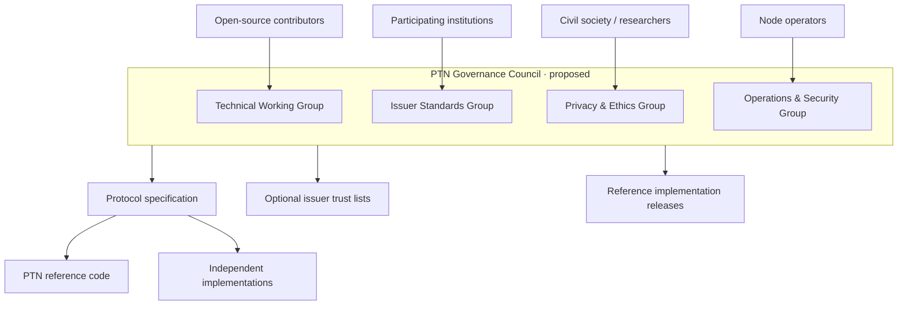
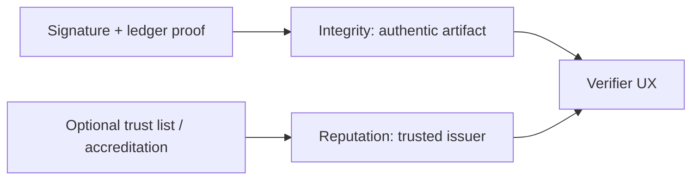

# Governance

Pakistan Trust Network aims to become an **open protocol** for credential issuance and verification — not a closed vendor silo and not a government franchise.

Today’s repository is a **reference implementation** operated by whoever deploys it. The following describes a **proposed future** governance model. Nothing here asserts current legal authority or government endorsement.

**Issue. Own. Verify.** remains the product north star. **Proof on-chain / data off-chain** remains the technical north star.

---

## Open protocol goals

1. **Interoperable issuance** — universities, employers, and training providers can implement the same credential and ledger proof semantics.  
2. **Holder agency** — individuals own wallet access and CV publication choices.  
3. **Anyone can verify** — public verification without proprietary gatekeeping.  
4. **No token requirement** — participation must never depend on purchasing a cryptocurrency.  
5. **Transparent integrity** — chain verification and auditability are first-class.  
6. **Privacy by construction** — sensitive national identifiers stay off the ledger and out of credential subjects.

---

## Proposed governance council (future)

### Suggested responsibilities

| Body | Scope |
|------|-------|
| Technical Working Group | Ledger formats, crypto agility, API versioning |
| Issuer Standards Group | Credential type registry, revocation norms, demo labelling |
| Privacy & Ethics Group | Prohibited fields, retention guidance, disclosure norms |
| Operations & Security Group | Validator admission (if multi-node), incident response baselines |

Decisions should be recorded publicly (RFCs / Git issues / meeting notes). No single company should silently redefine “verified” for the whole network.

---

## Trust lists vs cryptography

Cryptographic verification answers: *Was this credential signed by key K and anchored?*  
Governance answers: *Should verifiers treat issuer I as reputable?*

PTN’s code must keep these layers separable. A valid signature from a demo key is still cryptographically valid — UIs must show **DEMO** labels. Future trust lists should be explicit, auditable, and never confused with government mandate unless a real authority independently asserts that (outside this project’s claims).

---

## Validator admission (multi-node future)

When the ledger moves beyond a shared-database demo:

1. Council publishes validator criteria (uptime, key custody, jurisdiction disclosures).  
2. New validators complete a key ceremony and appear in a signed validator set.  
3. Blocks require quorum according to the protocol revision.  
4. Misbehavior (equivocation) triggers documented slashing-of-trust (removal), **not** a financial token slash.

---

## What governance explicitly is not

- Not a claim of ministry ownership  
- Not a national ID replacement  
- Not a cryptocurrency foundation with speculative assets  
- Not a requirement that all Pakistanis use PTN  

---

## Near-term project governance (today)

Until a formal council exists:

- Changes land through pull requests and CI ([contributing.md](contributing.md))  
- Security-sensitive changes should be reviewed carefully  
- Spec docs in `/docs` are the source of design intent  
- Maintainers may mark credentials/orgs as demo and refuse misleading branding  

---

## Related docs

- [Blockchain](blockchain.md)  
- [Privacy](privacy.md)  
- [Contributing](contributing.md)
