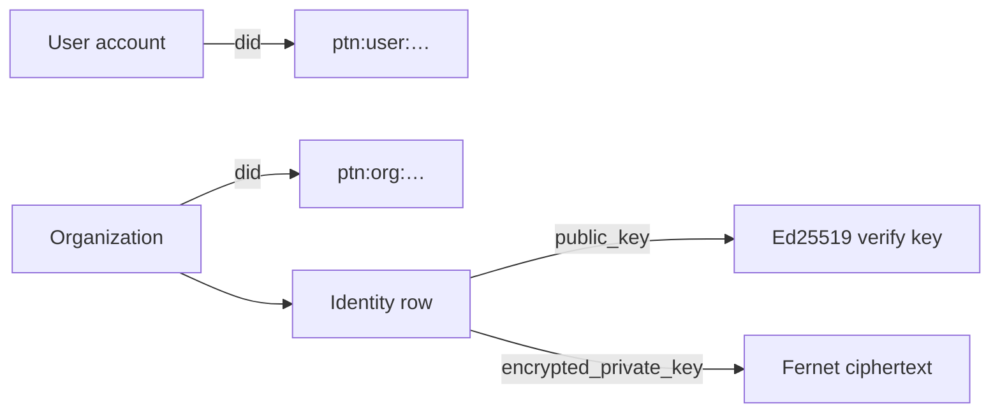
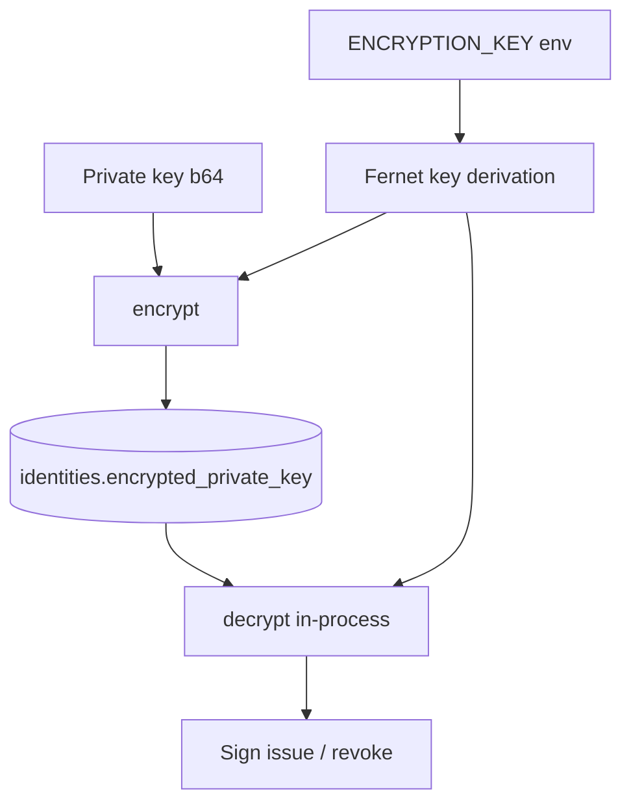
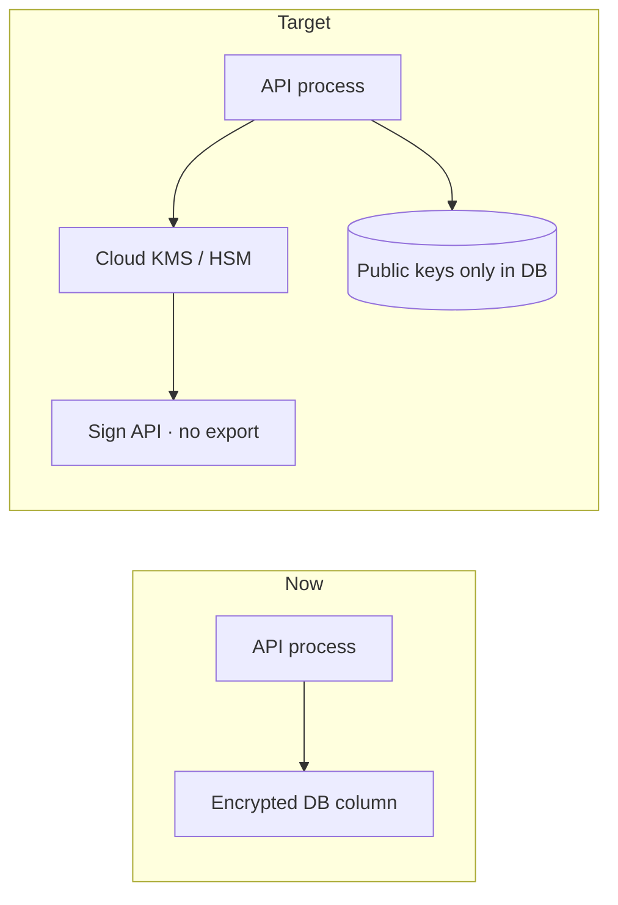

# Identity

PTN identities are lightweight, protocol-local DIDs plus Ed25519 keys for institutional issuers.

**Disclaimer:** PTN is not a national digital ID system and is not endorsed by any government.

---

## DID formats

| Kind | Pattern | Example |
|------|---------|---------|
| Organization | `ptn:org:{16 hex}` | `ptn:org:a1b2c3d4e5f67890` |
| User / holder | `ptn:user:{16 hex}` | `ptn:user:0f1e2d3c4b5a6978` |
| Validator (ops) | `ptn:validator:{name}` | `ptn:validator:genesis` |

DIDs are generated with cryptographic randomness (`secrets.token_hex(8)`). They identify actors inside PTN; they are not W3C DID method registrations in this MVP.

---

## Organizational cryptographic identity

When an organization is created, PTN immediately provisions an `Identity`:

1. Generate Ed25519 keypair (PyNaCl `SigningKey`)  
2. Store **public key** (base64) in cleartext for verification  
3. **Encrypt** private key with Fernet derived from `ENCRYPTION_KEY`  
4. Set `key_algorithm = "Ed25519"`, `status = "ACTIVE"`  
5. Audit `identity_created` with a public-key fingerprint only — never the private key  

Endpoints:

- `POST /api/organizations/{org_id}/identity` — create if missing  
- `GET /api/organizations/{org_id}/identity` — public key metadata  

`issuer_id` on the identity matches the organization DID.

---

## Ed25519 usage

| Operation | Signed message |
|-----------|----------------|
| Issue | Canonical JSON of `{credential_hash, issuer, credential_id}` |
| Revoke | Canonical JSON of `{action: REVOKE, credential_id, credential_hash}` |

Verification uses the stored public key only. Holders do not need org private keys to prove ownership of wallet entries; verifiers check issuer signatures and ledger proofs.

---

## Encrypted keys at rest

Notes:

- Prefer a real Fernet key (url-safe base64, 32 bytes). Passphrases are accepted via SHA-256 derivation for development only.  
- Rotate `ENCRYPTION_KEY` carefully — existing ciphertext must be re-encrypted.  
- Application memory briefly holds plaintext keys during signing; process hardening and HSM migration reduce this risk.

---

## Users without signing keys (MVP)

Individual users receive a `ptn:user:…` DID at registration but do not hold issuer signing keys in the current MVP. Their “ownership” is account binding: credentials reference `holder_id` / holder DID, and wallet APIs enforce authentication.

Future iterations may add holder-bound presentation proofs (selective disclosure, holder signatures). The protocol leaves room without requiring a token or public chain.

---

## Roles vs cryptographic identity

| Layer | Examples |
|-------|----------|
| Platform RBAC | `individual`, `organization`, `admin`, `verifier` |
| Org membership | `OWNER`, `ISSUER`, `ADMIN`, `VIEWER` |
| Crypto identity | Ed25519 org keys tied to `ptn:org:…` |

Authorization decides *who may call issue*; cryptography decides *whether a credential is authentic*.

---

## HSM / KMS future

Recommended evolution path:

1. **Cloud KMS** (AWS KMS, GCP KMS, Azure Key Vault) for org and validator keys  
2. **HSM** for high-assurance institutional issuers  
3. **Key ceremony + dual control** for root validator sets  
4. **Algorithm agility** (document migration from Ed25519 if needed)  
5. Keep **proof on-chain / data off-chain** unchanged — only key custody improves  

Until then, treat `ENCRYPTION_KEY` and database access as crown jewels.

---

## Related docs

- [Credentials](credentials.md)  
- [Security](security.md)  
- [Governance](governance.md)
