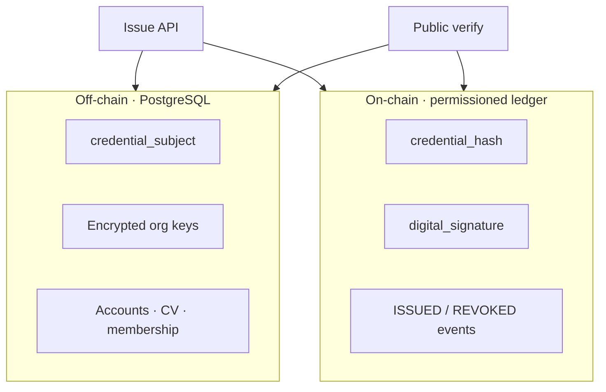

# Privacy

PTN separates **public integrity proofs** from **private credential data**.

> **Proof on-chain. Data off-chain.**

The system is built so verification can succeed without publishing CNICs, home addresses, or other high-risk personal data on a ledger.

PTN is **not** a government identity platform and does **not** claim NADRA, ministry, or regulator endorsement.

---

## On-chain vs off-chain

| Data | On-chain (ledger) | Off-chain (app DB) | Public verify API |
|------|-------------------|--------------------|-------------------|
| Credential id | Yes | Yes | Yes |
| Credential hash | Yes | Yes | Yes |
| Issuer DID | Yes | Yes | Yes |
| Holder DID | In tx payload / off-chain | Yes | Yes (DID) |
| Ed25519 signature | Yes (tx) | Yes | Proof type reported |
| Metadata hash | Yes | Yes | Indirect |
| Transaction type / status events | Yes | Yes | Via overall status |
| Credential title | No* | Yes | Yes (display) |
| Full `credential_subject` | **No** | Yes | Filtered `public_subject` |
| Email / password | **No** | Yes (hash for password) | No |
| Org encrypted private key | **No** | Yes (ciphertext) | No |
| CNIC / national ID | **No** (stripped) | **Must not store** | No |
| Passport, address, phone | **No** (stripped) | **Must not store** | No |
| DOB, salary, biometrics | **No** (stripped) | **Must not store** | No |
| Audit log details | No | Yes (hash-chained) | No |

\* Titles may appear in application UIs and filtered API responses; they are not the ledger’s primary content. Ledger payloads keep hashes and DIDs foremost.

---

## Fields stripped at issuance

`CredentialService.issue` removes sensitive keys from `credential_subject` before hashing and storage (case-insensitive key match), including:

- `cnic`
- `passport`, `passport_number`
- `address`
- `phone`
- `email`
- `date_of_birth`, `dob`
- `salary`
- `biometric`

Integrators must still avoid sending these fields. Stripping is defense in depth, not a license to collect them elsewhere.

---

## Holder display minimization

Public verification returns a **minimized holder display name** (first name + last initial) plus DID — not email, username, or contact channels.

Issuer responses include name, DID, verification status, and demo labels when applicable.

---

## CV visibility controls

| Mode | Exposure |
|------|----------|
| `PRIVATE` | No public CV |
| `PUBLIC` | Username-based URL |
| `LINK_ONLY` | Requires unguessable `share_token` |

Holders choose what career narrative to publish; underlying credentials remain independently verifiable via credential links.

---

## Demo data honesty

Seeded organizations set:

- `is_demo = true`
- `demo_label = "DEMO — NOT AN ACTUAL VERIFIED INSTITUTION"`

Verification UIs should surface these flags so nobody mistakes the sandbox for real institutional trust.

---

## Operator obligations

1. Do not extend schemas to store national identifiers “just in case.”  
2. Keep `ENCRYPTION_KEY`, `JWT_SECRET`, and database backups access-controlled.  
3. Prefer retention policies and audit access reviews in production.  
4. Remember: hashes on a ledger are permanent within that deployment — never hash raw CNICs into credential payloads.  
5. Rate-limit and monitor public verify endpoints against scraping.

---

## Related docs

- [Architecture](architecture.md)  
- [Credentials](credentials.md)  
- [Security](security.md)
