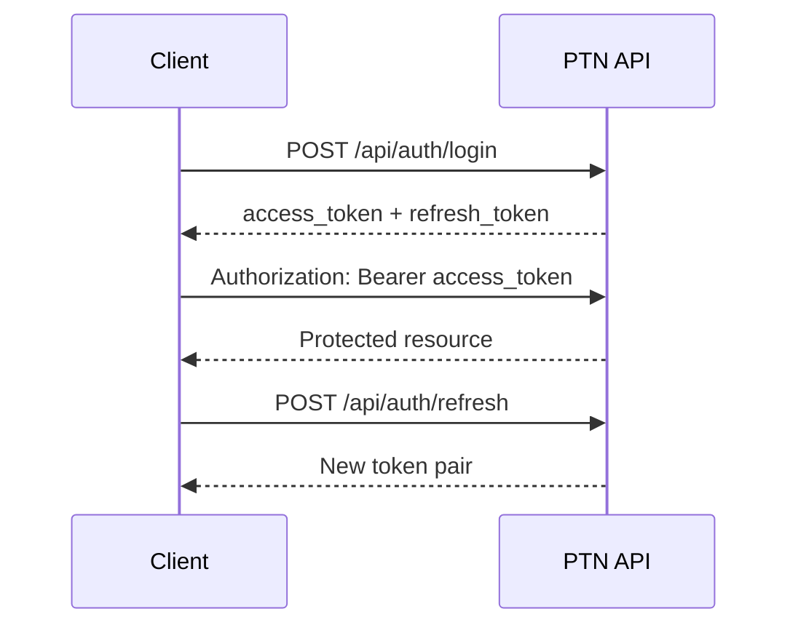
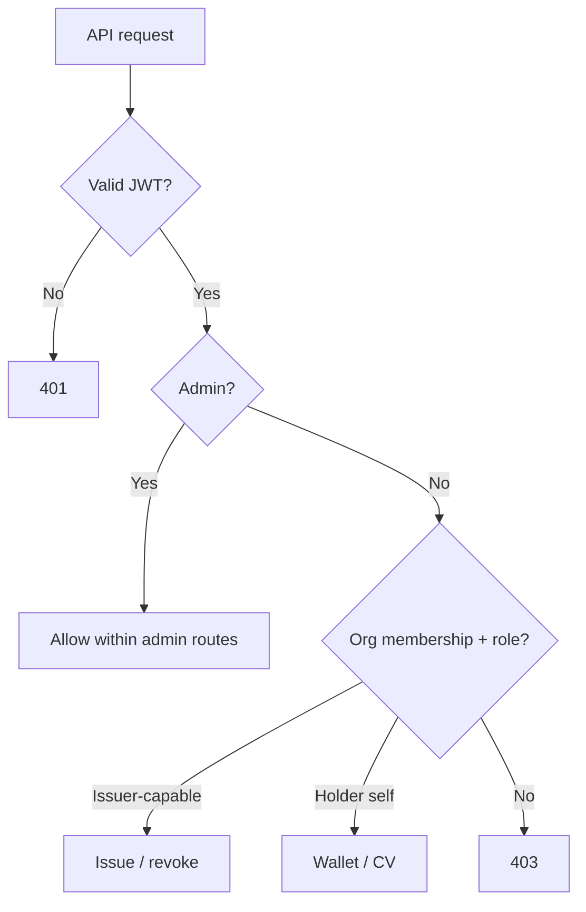

# Security

Security in PTN protects accounts, authorization boundaries, and cryptographic integrity of credentials — while keeping **proof on-chain** and **data off-chain**.

This document describes the **reference implementation**. Deployers must still harden production environments. PTN is not government-endorsed infrastructure.

---

## Threat model (summary)

| Threat | Mitigation |
|--------|------------|
| Password theft | argon2 hashing |
| Session abuse | Short-lived JWT access + refresh rotation pattern |
| Privilege escalation | Role checks + org membership roles |
| Credential forgery | Ed25519 signatures + ledger hash anchoring |
| Silent history rewrite | `verify_chain` link/Merkle/hash checks |
| XSS / clickjacking basics | Security headers |
| API abuse | Per-IP rate limiting |
| Sensitive PII on ledger | Hash-only proofs; subject field stripping |

---

## Authentication (JWT)

| Setting | Default (env) | Notes |
|---------|---------------|-------|
| `JWT_SECRET` | required ≥ 32 chars | HMAC secret |
| `JWT_ALGORITHM` | `HS256` | Configurable |
| `JWT_ACCESS_TOKEN_EXPIRE_MINUTES` | `30` | Short-lived |
| `JWT_REFRESH_TOKEN_EXPIRE_DAYS` | `14` | Longer-lived refresh |

Access tokens embed `sub` (user id), `role`, `did`, and `type=access`. Refresh tokens use `type=refresh`. Wrong type → 401.

HTTP Bearer scheme via FastAPI `HTTPBearer`.

---

## Passwords (argon2)

Passwords are hashed with **argon2** through Passlib (`CryptContext(schemes=["argon2"])`). Plaintext passwords are never stored. Demo and admin bootstrap passwords come from environment variables — change them outside local demos.

---

## RBAC

### Platform roles (`User.role`)

| Role | Intent |
|------|--------|
| `individual` | Holder / student |
| `organization` | Org-affiliated operator |
| `admin` | Platform administration |
| `verifier` | Reserved for verifier personas |

### Organization membership roles

| Role | Can issue / revoke |
|------|--------------------|
| `OWNER` | Yes |
| `ISSUER` | Yes |
| `ADMIN` | Yes |
| `VIEWER` | No |

Platform `admin` may act across orgs for operational endpoints. Ledger history remains append-only; admins cannot “edit” past blocks through normal APIs.

---

## Security headers

Middleware sets:

| Header | Value |
|--------|-------|
| `X-Content-Type-Options` | `nosniff` |
| `X-Frame-Options` | `DENY` |
| `Referrer-Policy` | `strict-origin-when-cross-origin` |
| `Permissions-Policy` | `geolocation=(), microphone=(), camera=()` |
| `Strict-Transport-Security` | `max-age=31536000; includeSubDomains` (**production only**) |

CORS origins come from `PTN_CORS_ORIGINS` (comma-separated allowlist). Never use `*` with credentials in production.

---

## Rate limiting

SlowAPI limiter keyed by remote address:

- Default: `RATE_LIMIT_PER_MINUTE` (default **120**/minute)
- Exceeded requests receive standard rate-limit errors

Tune per deployment; put an edge WAF/CDN in front for public verify traffic if needed.

---

## Cryptographic controls

| Control | Implementation |
|---------|----------------|
| Issuer signatures | Ed25519 (PyNaCl) |
| Private key at rest | Fernet (`ENCRYPTION_KEY`) |
| Content integrity | SHA-256 canonical JSON |
| Ledger links | previous_hash + block_hash |
| Batch integrity | Merkle root |
| Audit trail | Hash-chained audit entries |

Dev-only tamper endpoints exist to **demonstrate** failure modes. They refuse to run when `PTN_ENV=production`.

---

## Secrets hygiene

- Never commit `.env` with real secrets  
- Use `.env.example` as a template only  
- Rotate `JWT_SECRET` and `ENCRYPTION_KEY` with a documented process  
- Prefer managed secrets (Render / Vercel / Supabase / cloud secret managers)  
- No hardcoding of production credentials in source  

See [deployment.md](deployment.md).

---

## Logging & errors

- Production unhandled errors return generic `Internal server error`  
- Debug detail only when `PTN_DEBUG=true`  
- Audit actions record actor DIDs and resource ids — avoid putting secrets in `details`

---

## Related docs

- [Identity](identity.md)  
- [Privacy](privacy.md)  
- [API](api.md)
